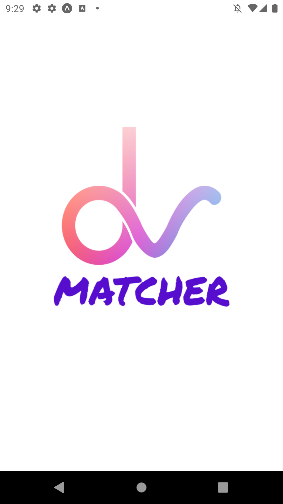
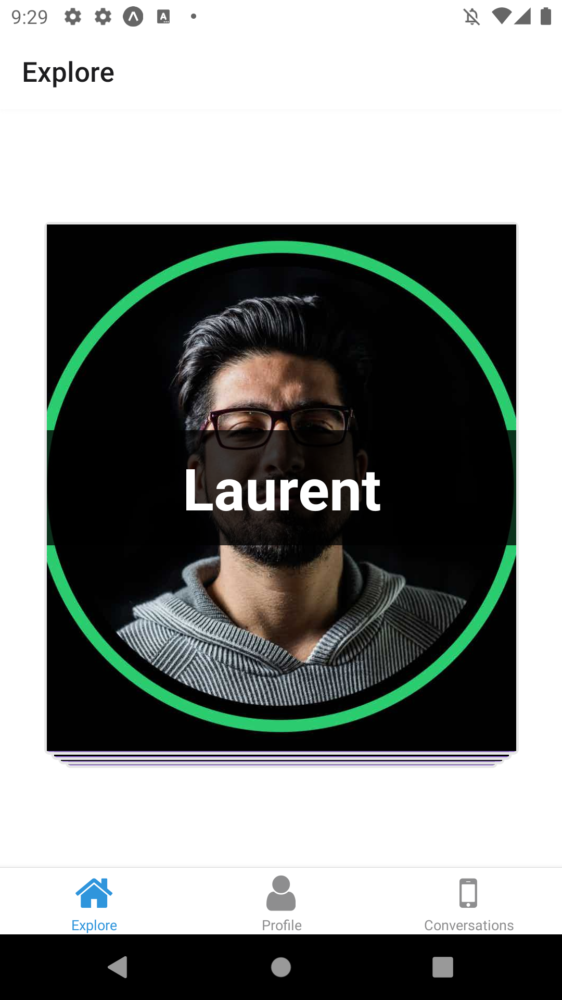
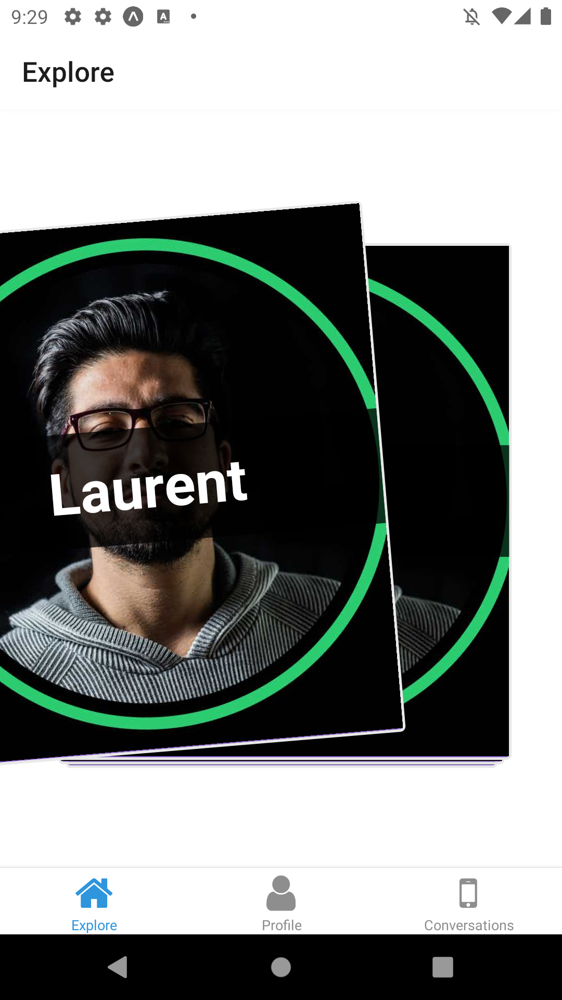
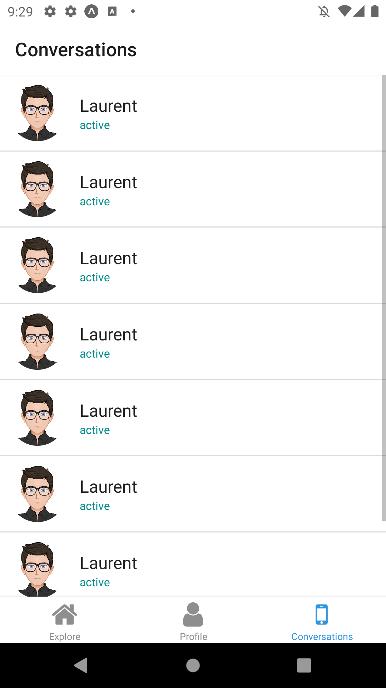

# rendu React - Matcher

Ce projet a pour but de challenger nos compétences en développement,
à travers différents frameworks : node avec typescript, et react native

## Objectif de Features

- authentification, account management
l'utilisateur pourra créer un compte et mettre à jour ses information et ses photos

- matching par localisation
les utilisateurs matcheront en premier lieu les utilisateurs les plus proches d'eux,
dans un second temps, ils matcheront peut être selon leurs préférences

- match -> chat
les utilisateurs qui matchent peuvent s'envoyer des messages

## archi

- Front, interface en réact

- API nodejs / typescript

## roadmap

### coté api

1. Initialisation de l'api avec système d'auth

2. intégration de l'inscription : photos, informations

3. route "actualisation du menu" : l'api renvoie les profils recommandés à l'app

4. route "je like" : quand l'utilisateur like

5. route modification du profil

6. chat : à spécifier

### coté front

1. créer les vues pour l'inscription et la connexion

2. créer la vue du profil

3. '' vue de la homepage avec possibilité d'afficher et de swipp

4. '' vue modification du profil

5. vue du chat

## Maquettes

Aperçu :










## USAGE DEV

### lancer l'api

```ps
cd .\BackDev\
npm i 
npm start
```

pour forwarder le port 3000 vers internet sur lequel écoute l'api :
ouvrir un autre shell

```
ngrok http 3000
```

préciser l'adresse de forward dans le .env

### lancer l'appli

```
cd .\ReactTinderLikeProject\
yarn install
npm start
```

ou https://expo.dev/@rastain42/matcher-mobile